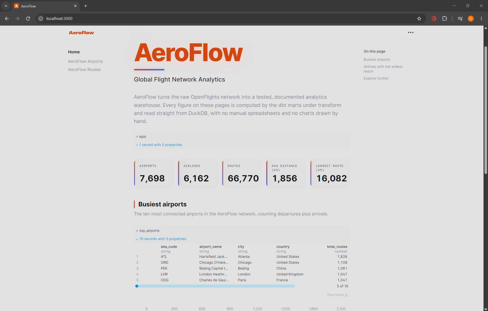
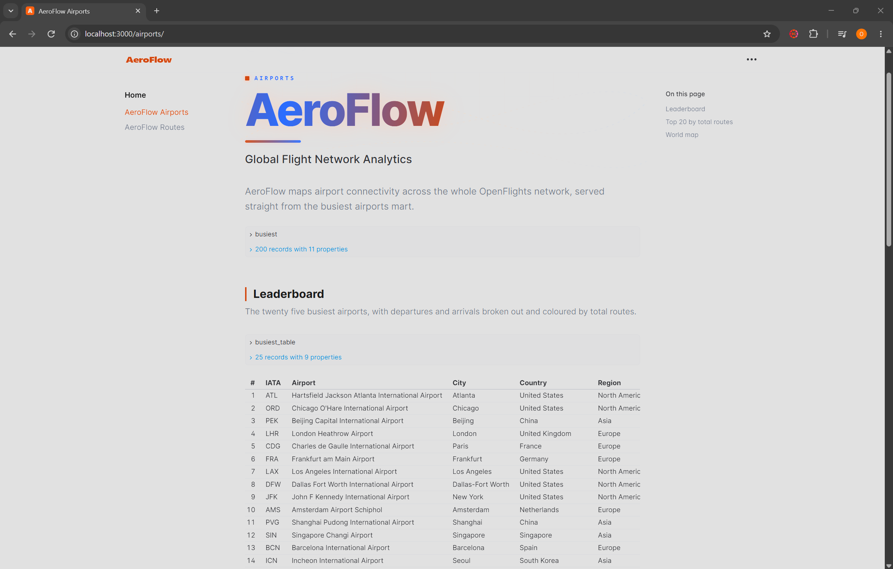
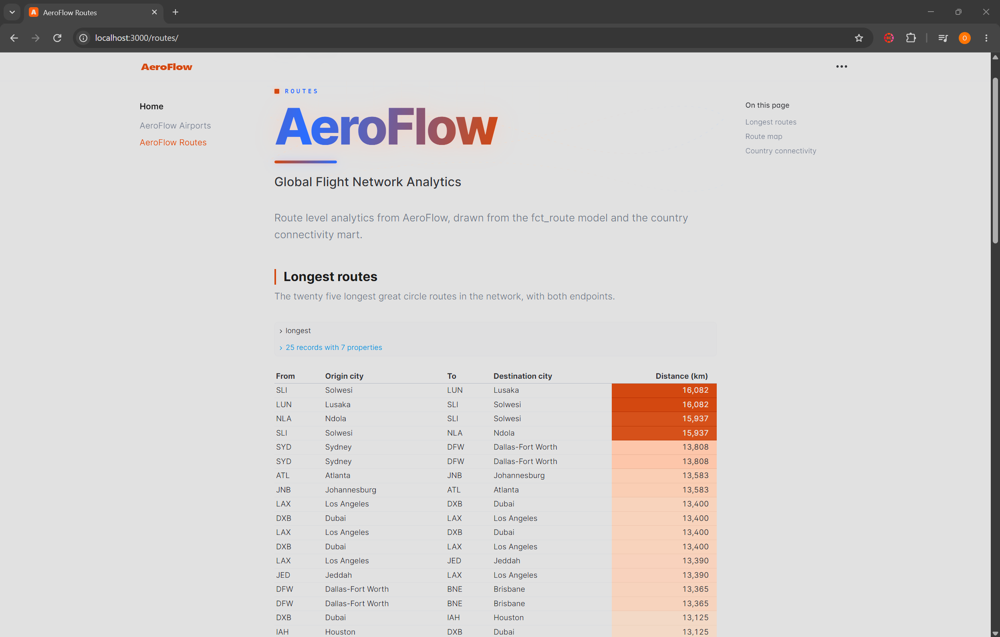
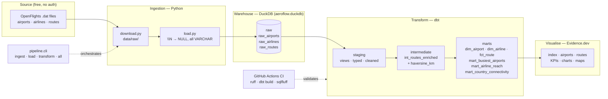

# AeroFlow ✈️

[](.github/workflows/ci.yml)
[](transform/)
[](https://duckdb.org)
[](dashboard/)
[](LICENSE)

**AeroFlow** is an end-to-end analytics-engineering pipeline over the global
flight network. It ingests the free [OpenFlights](https://openflights.org/data.html)
datasets, loads them into a local **DuckDB** warehouse, transforms them with
**dbt** (staging → intermediate → marts, fully tested and documented),
orchestrates the whole thing behind a small **Typer CLI**, validates every change
in **GitHub Actions CI**, and visualises the results with an **Evidence.dev**
"BI-as-code" dashboard. The same dbt models run on **Snowflake** by switching a
single target - so this repo doubles as a portable ELT reference.

> Built by **Omar Rifaie**.

---

## Screenshots


| Overview | Airports | Routes |
| --- | --- | --- |
|  |  |  |

---

## Architecture



Data flows one way - **ingest → load → transform → visualise** — with tests and
lint gates at every boundary. See [`docs/architecture.md`](docs/architecture.md)
for a layer-by-layer breakdown and [`docs/data_dictionary.md`](docs/data_dictionary.md)
for every mart column.

---

## Stack

| Layer            | Tooling                                                        |
| ---------------- | ------------------------------------------------------------- |
| Ingestion        | Python 3.11+, `requests`, `duckdb`                            |
| Orchestration    | `typer` CLI (`python -m pipeline.cli`)                        |
| Warehouse        | DuckDB locally · Snowflake by switching the dbt target       |
| Transformations  | `dbt-core` + `dbt-duckdb`, `dbt_utils`, `dbt_expectations`   |
| Quality gates    | `ruff` (Python), `sqlfluff` (SQL), `pre-commit`, GitHub CI   |
| Dashboard        | Evidence.dev (Node 18+)                                       |

---

## Prerequisites

- **Python 3.11+**
- **Node 18+** (only for the dashboard)
- No cloud account and no API keys required - the data source is public and the
  default warehouse is a local DuckDB file.

---

## Quickstart

```bash
# 1. Set up the Python environment and install dependencies
make setup

# 2. Run the full pipeline: download -> load -> dbt build (models + tests)
make all

# 3. Explore the data in the Evidence dashboard (http://localhost:3000)
make dashboard
```

Prefer to skip `make`? The equivalent commands are:

```bash
python -m venv .venv && . .venv/bin/activate      # Windows: .venv\Scripts\activate
pip install -e ".[dev]"
python -m pipeline.cli all
cd dashboard && npm install && npm run dev
```

### Individual steps

```bash
python -m pipeline.cli ingest       # download raw .dat files to data/raw/
python -m pipeline.cli load         # load into DuckDB schema `raw`
python -m pipeline.cli transform    # dbt deps + dbt build
python -m pipeline.cli all          # all of the above, in order
```

---

## Run it on Snowflake

The dbt models are written in portable, ANSI/Snowflake-compatible SQL. To build
the exact same project on Snowflake instead of DuckDB:

```bash
cp .env.example .env      # then fill in your Snowflake details
set -a && . ./.env && set +a

cd transform
dbt deps
dbt build --target snowflake
```

The `snowflake` target in [`transform/profiles.yml`](transform/profiles.yml)
reads `SNOWFLAKE_ACCOUNT`, `SNOWFLAKE_USER`, `SNOWFLAKE_PASSWORD`,
`SNOWFLAKE_ROLE`, `SNOWFLAKE_WAREHOUSE`, `SNOWFLAKE_DATABASE` and
`SNOWFLAKE_SCHEMA` from the environment. No model SQL changes are required - only
the target switches.

---

## Project layout

```
aeroflow/
├── ingestion/     # download + load OpenFlights -> DuckDB (schema raw)
├── pipeline/      # Typer CLI orchestrating ingest/load/transform/all
├── transform/     # dbt project: staging -> intermediate -> marts (+ tests, macros, seeds)
├── dashboard/     # Evidence.dev BI-as-code dashboard
├── docs/          # architecture + data dictionary
└── .github/       # CI workflow
```

---

## Testing & quality

Every `dbt build` runs the models **and** the data tests:

- `not_null` / `unique` on all keys, `relationships` from `fct_route` to the
  dimensions, `accepted_values` on categorical columns.
- `dbt_expectations` assertions (non-empty fact table, distances within
  physically plausible bounds).
- A singular test (`assert_positive_route_distance`) guaranteeing every route
  distance is strictly positive.
- Source **freshness** configured on the raw load timestamp.

Linting runs in CI and via `pre-commit`:

```bash
make lint          # ruff (Python) + sqlfluff (SQL)
pre-commit install # optional: run the gates on every commit
```

---

## Data & license

- **Data:** [OpenFlights](https://openflights.org/data.html) airports, airlines
  and routes. © OpenFlights contributors, distributed under the
  [Open Database License (ODbL)](https://opendatacommons.org/licenses/odbl/1-0/).
  AeroFlow downloads these files at run time and does not redistribute them.
- **Code:** MIT - see [LICENSE](LICENSE).
