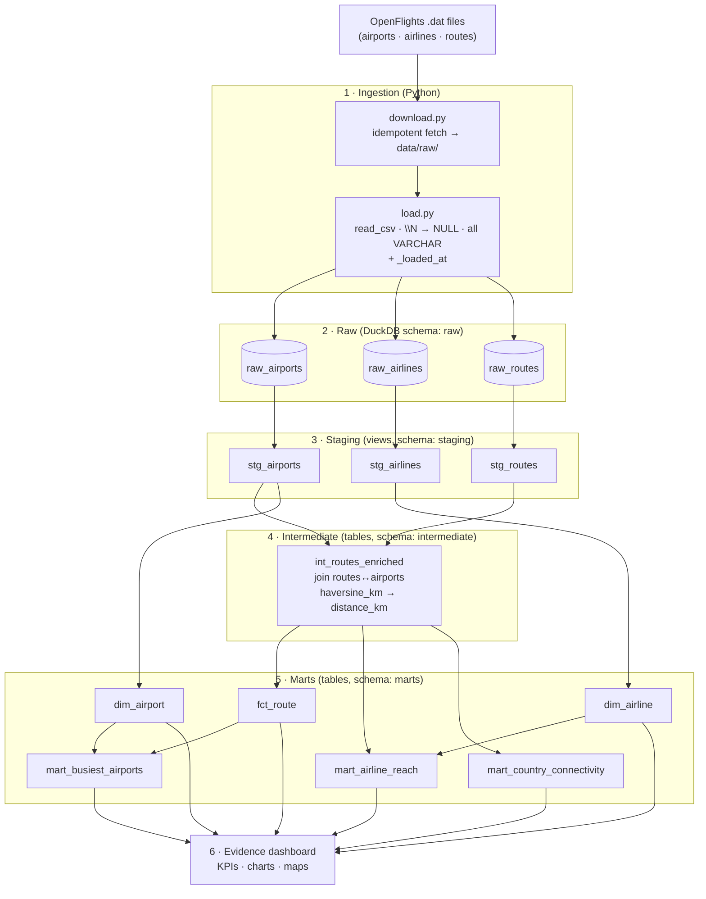

# AeroFlow Architecture

AeroFlow is a linear ELT pipeline: **extract** the raw OpenFlights files,
**load** them untouched into DuckDB, then **transform** them in dbt through three
increasingly refined layers before serving them to an Evidence dashboard. Each
arrow below is a one-way dependency; nothing downstream writes back upstream.

## Layers

### 1 · Ingestion (`ingestion/`)

- **`sources.py`** declares the three datasets: URL, ordered column names (the
  files have no header row), and target raw table name.
- **`download.py`** fetches each `.dat` file into `data/raw/`, skipping files that
  already exist unless `--force` is passed.
- **`load.py`** reads each file with DuckDB's `read_csv`, converts the literal
  `\N` token to `NULL`, keeps every column as `VARCHAR`, appends a `_loaded_at`
  timestamp, and writes it to the `raw` schema of `transform/aeroflow.duckdb`.

Loading everything as text keeps ingestion robust — no row is ever rejected for a
bad value; typing and validation are deferred to the staging models where they
are debuggable in SQL.

### 2 · Raw (`raw` schema)

Verbatim copies of the source files. The only added column is `_loaded_at`, which
dbt **source freshness** watches.

### 3 · Staging (`models/staging/`, views)

One cleaned view per source, 1:1 with the raw table:

- rename to `snake_case`, cast types with `try_cast` (portable across DuckDB and
  Snowflake),
- convert empty strings / `\N` to `NULL`,
- normalise categoricals (e.g. the airline `active` flag, which mixes `Y`, `N`
  and a stray lowercase `n`),
- drop structurally broken rows (missing airport ids, self-loop routes).

Materialised as **views** — they are cheap and always reflect the latest raw load.

### 4 · Intermediate (`models/intermediate/`, tables)

`int_routes_enriched` joins each route to its source and destination airport to
attach coordinates, then computes `distance_km` via the portable
[`haversine_km`](../transform/macros/haversine_km.sql) macro. Inner joins drop
routes that reference unknown airports, guaranteeing a well-defined distance.
Materialised as a **table** because it is the heaviest join and feeds several
marts.

### 5 · Marts (`models/marts/`, tables)

A small star schema plus three analytical marts:

- **`dim_airport`** / **`dim_airline`** — conformed dimensions (with a region
  attribute joined from the `seed_region_lookup` seed).
- **`fct_route`** — the fact table; grain = one row per airline / source /
  destination, with foreign keys to both dimensions and a `distance_km` measure.
- **`mart_busiest_airports`**, **`mart_airline_reach`**,
  **`mart_country_connectivity`** — pre-aggregated answers to the headline
  questions, ready for the dashboard.

### 6 · Visualisation (`dashboard/`)

An Evidence.dev project whose pages are Markdown + SQL querying the `marts`
schema directly from the DuckDB file. See [`dashboard/README.md`](../dashboard/README.md).

## Portability

The warehouse is swappable: [`transform/profiles.yml`](../transform/profiles.yml)
defines a `duckdb` target (default) and a `snowflake` target that reads
credentials from the environment. Because all SQL is ANSI/Snowflake-compatible
and the one dialect-sensitive piece (the great-circle distance) is isolated in a
macro using functions common to both engines, `dbt build --target snowflake`
produces the identical models on Snowflake.

## Orchestration & CI

- **`pipeline/cli.py`** (Typer) exposes `ingest`, `load`, `transform` and `all`,
  runnable as `python -m pipeline.cli all`.
- **`.github/workflows/ci.yml`** runs on pull requests and on pushes to any
  branch except `main`: install → `ruff check` → ingest + load → `dbt build`
  (models **and** tests) → `sqlfluff lint`.
